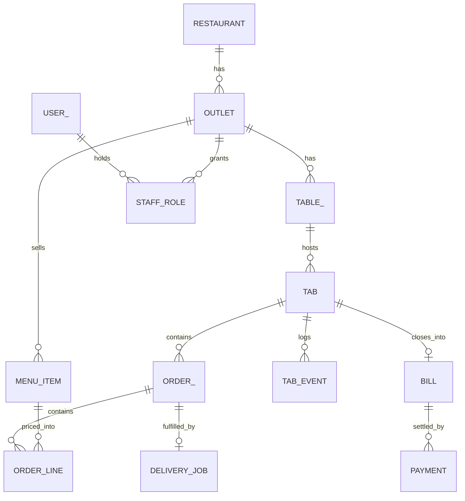
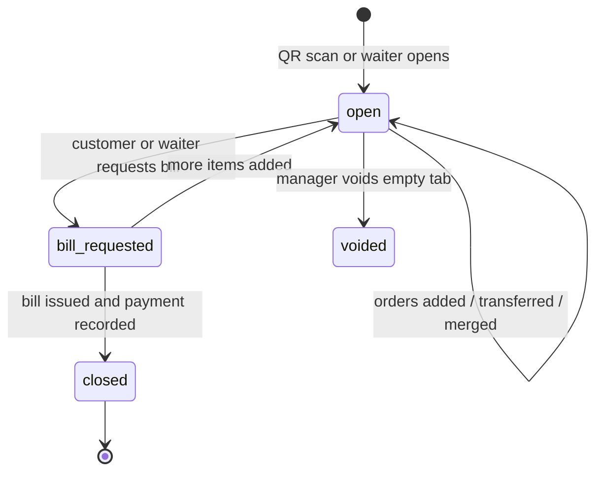
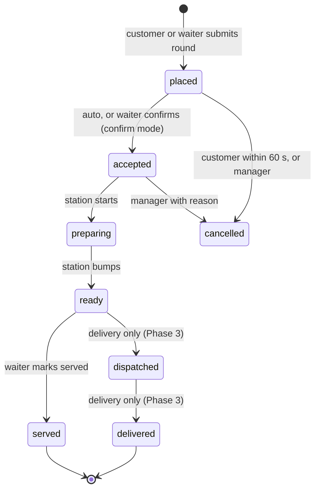
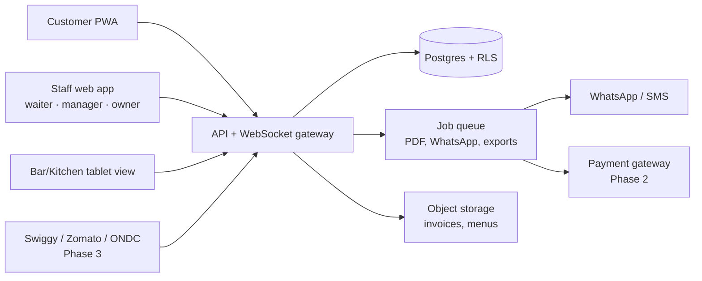

# QR Ordering & Billing SaaS for Indian Restaurants, Bars & Clubs — Product Spec

## 1. Problem statement

Indian restaurants, bars and clubs lose revenue and goodwill because one waiter is the bottleneck for every order, and because bills are contested when they arrive. Customers wait for a waiter to reach them, waiters queue at the counter to key in orders, and at close the bill contains items or prices the customer does not recognise.

The three problems reported from venues, in order of frequency:

1. Slow first order: time from seating to first order placed is long at peak.
2. Waiter bottleneck: one waiter serves 8–12 tables; others wait while orders are taken.
3. Item and price disputes: "I did not order that" and "the menu card says a different price". Service charge and tax disputes are not the main issue at target venues.

**Target segment (first 12 months):** independent restaurants, bars and clubs in Indian metros with 15–60 tables, currently billing via a basic POS or handwritten KOTs, accepting UPI, card and cash. Chains and cloud kitchens are out of scope until Phase 3.

**Product in one line:** scan a QR at the table, order from your phone, watch a live itemised tab, pay by UPI, card or cash; staff see only what their role needs.

## 2. Goals, success metrics and non-goals

The MVP succeeds if pilot venues measurably order faster and dispute less, and owners renew after the pilot.

| Metric | How measured | Baseline (measure before pilot) | Target after 4 weeks |
| --- | --- | --- | --- |
| Seat-to-first-order time (peak) | Timestamp: tab opened → first order placed | Manual stopwatch sample, 30 tables | −50% |
| Disputes per 100 bills | Manager marks a bill "disputed" at close | Owner's estimate + 1 week of tallying | −70% |
| Share of orders placed by customer (not waiter) | Order line `placed_by` | 0% | ≥ 60% |
| Voids and manager overrides per 100 bills | Void events with reason | Unknown | Tracked, trending down |
| Owner renews after pilot | Yes/no | — | 2 of 3 venues |

**Non-goals for MVP** (explicitly not built; see section 4): kitchen display system, delivery, in-app card/UPI collection by us, POS integration, loyalty, inventory, reservations, native app-store apps.

**Assumption to validate:** customers at bars will order from a phone rather than call a waiter if ordering takes under 20 seconds and the tab is visible. If the customer-placed share stays below 30% at the bar pilot, the product needs a waiter-first redesign, not more features.

## 3. Use cases

Six actors; the customer and waiter flows carry the MVP, the rest support them. Each use case names the data it touches so the schema in section 7 can be checked against it.

| Actor | Use case | MVP | Data touched |
| --- | --- | --- | --- |
| Customer | Scan table QR, see menu, no signup | Yes | Table, TabSession, Menu |
| Customer | Place order with modifiers, notes, quantity; repeat last round | Yes | Order, OrderLine, Modifier |
| Customer | See live itemised tab, who added each line, running total with tax | Yes | Tab, OrderLine, TabEvent |
| Customer | Acknowledge a staff-added line above a threshold | Yes | OrderLine.ack |
| Customer | Request bill; call waiter; request water | Yes | ServiceRequest |
| Customer | Pay by UPI or card in-app; split bill | Phase 2 | Payment, PaymentIntent |
| Customer | Order for pickup or delivery, track status | Phase 3 | Order.fulfillment\_type, DeliveryJob |
| Waiter | See assigned tables, open tabs, new orders in real time | Yes | Table, Tab, Order |
| Waiter | Add items on the customer's behalf; mark served | Yes | OrderLine.placed\_by |
| Waiter | Open a tab manually (walk-in without phone), transfer or merge tables | Yes | Tab, TabEvent |
| Waiter | Close tab: record UPI/card/cash, split by amount | Yes | Bill, Payment |
| Bar / kitchen | See ticket queue by station; mark preparing and ready | Basic view; full KDS Phase 2 | Ticket, Station |
| Bar / kitchen | Mark an item sold out | Yes | MenuItem.available |
| Manager | Void or discount a line with reason; approve liquor lines where required | Yes | TabEvent, Approval |
| Manager | Review a disputed bill: full event log | Yes | TabEvent, Bill |
| Manager | Day close: sales by method, voids, discounts | Yes | Bill, Payment, Report |
| Manager | Set happy hour and event pricing windows | Yes | PriceRule |
| Owner | Edit menu, categories, modifiers, tax classes; import from CSV | Yes | Menu, MenuItem, TaxClass |
| Owner | Import menu from photo/PDF with review step | Phase 2 | MenuImport |
| Owner | Manage staff and roles; phone-number login; invite by WhatsApp link | Yes | User, StaffRole |
| Owner | Generate table QRs; print menu PDF from current data | Yes | Table, QRCode |
| Owner | Multi-outlet dashboard; export to Tally/CSV | Phase 2 | Outlet, Export |
| Owner | Push bills to POSist and others | Phase 2 | Bill, Integration |
| Platform admin | Onboard restaurant, billing plan, suspend, support impersonation with audit | Yes | Restaurant, Subscription, AuditLog |

## 4. MVP scope

The MVP is a self-ordering and transparent-tab product with GST-compliant billing, for dine-in only, targeted at 8–12 weeks of build for a team of 3–4.

**In scope**

- Customer PWA: scan → menu → order in under 20 seconds, live tab, request bill/waiter. No login; optional phone number for receipt via WhatsApp/SMS.
- Staff web app (responsive, one codebase, role-scoped views): waiter, bar/kitchen, manager, owner.
- Menu editor with categories, modifiers, tax classes, availability toggle, CSV import, printable menu PDF.
- Per-table QR codes with session tokens; waiter confirmation mode for venues that want control.
- Price rules: happy hour / event windows; price locked on each order line at order time.
- Tab event log: every add, void, discount, price application, transfer, with actor and timestamp.
- Billing as system of record: GST invoice with CGST/SGST split, separate liquor VAT line, sequential numbering per outlet, immutable once issued.
- Payment recording: UPI (venue's own static QR shown to customer, waiter confirms), card terminal, cash; split by amount.
- Manager void/discount with mandatory reason; liquor-line approval toggle.
- Day-close report; CSV export.
- Offline tolerance: staff app queues actions for up to 5 minutes without Wi-Fi and syncs.
- Platform admin: onboarding, subscription plan, audit log.

**Out of scope for MVP** (each has a hook in the schema so it is additive later)

- Kitchen display system with station routing and prep timers (basic ticket list only).
- In-app payment collection by us (Razorpay/Cashfree) — Phase 2.
- Photo/PDF menu OCR — Phase 2, always with a review step.
- POSist / Petpooja / Tally push — Phase 2.
- Delivery, pickup, aggregator (Swiggy/Zomato) ingestion, ONDC — Phase 3.
- Multi-outlet chain dashboard — Phase 2.
- Native iOS/Android apps — not planned; PWA covers both.
- Loyalty, reservations, inventory, staff rostering.

## 5. Key product decisions

Each decision below is hard to reverse; the team should confirm or contest them before writing code.

| Decision | Choice | Rationale | Alternative rejected |
| --- | --- | --- | --- |
| Tenancy | Shared multi-tenant app; `restaurant_id` on every row; Postgres row-level security; dedicated instance offered later as a premium tier | Restaurants pay ₹1–5k/month; per-restaurant containers cost more than that and 200 deployments cannot be run by a small team | One container per restaurant |
| QR | One QR per table; encodes a short URL; server issues a `TabSession` token on scan with expiry | Routes orders to the right table; a photographed QR from last week cannot fire orders into an occupied table | One QR per restaurant |
| Menu digitisation | Manual editor + CSV first; OCR import in Phase 2 with mandatory owner review | OCR mis-reads prices and modifiers; wrong prices are the dispute we are trying to remove | "Scan and go live" |
| Price integrity | `unit_price` copied onto `OrderLine` at order time; `PriceRule` id recorded; later menu edits never touch open tabs | Directly removes the "menu says a different price" dispute | Join to live menu price at bill time |
| Staff-added lines | Flagged with waiter name on the customer's tab; lines above a threshold (default ₹500) need a customer tap to acknowledge | Removes "I did not order that" while still letting waiters serve | Waiter-only ordering, or no flag |
| Billing | The app is the billing system of record; `Bill` is an immutable document generated at tab close | Venues use UPI/card/cash without a serious POS; accountants need GST-compliant, numbered invoices | Bill inside the customer's POS |
| Payments | Record method only in MVP; venue's own UPI QR shown in-app; in-app collection in Phase 2 | Avoids PCI, KYC and settlement work before product-market fit; bars are mostly counter-paid anyway | Payment gateway in MVP |
| Positioning | "Waiters serve, phones capture" | Customers still call waiters for water, ice, advice; a staff-cut promise will fail at Indian bars | "Cut waiter headcount" |
| Customer identity | No signup; phone number optional for receipt | Any login step kills conversion at the table | Mandatory OTP login |
| Platform | PWA for customers; responsive web for staff; tablet for bar/kitchen | No install, single codebase; native apps add app-store friction and a second build | Native apps |
| Delivery readiness | `fulfillment_type` and `DeliveryJob` in the schema from day one; no UI until Phase 3 | Additive later without rewriting orders | Retrofit later |

## 6. Roles and permissions

Permissions are enforced on the API per `restaurant_id` and role; the UI only hides what the API already refuses. A user can hold different roles at different outlets; roles are additive (Owner ⊃ Manager ⊃ Waiter for read access).

| Capability | Waiter | Bar/Kitchen | Manager | Owner | Platform admin |
| --- | --- | --- | --- | --- | --- |
| View assigned tables and tabs | Yes | — | All | All | Audit only |
| Add order lines for a table | Yes | — | Yes | Yes | — |
| Mark served / preparing / ready | Served | Preparing, ready | Yes | Yes | — |
| Mark item sold out | — | Yes | Yes | Yes | — |
| Open, transfer, merge tabs | Yes | — | Yes | Yes | — |
| Close tab and record payment | Yes | — | Yes | Yes | — |
| Void or discount a line | — | — | With reason | With reason | — |
| Approve liquor lines (if enabled) | — | — | Yes | Yes | — |
| Reopen a closed bill (creates a credit note, never edits) | — | — | Yes | Yes | — |
| Edit menu, prices, tax classes | — | — | Availability only | Yes | — |
| Set price rules (happy hour) | — | — | Yes | Yes | — |
| Manage staff and roles | — | — | Waiters only | Yes | — |
| Generate table QRs | — | — | Yes | Yes | — |
| Day-close and sales reports | — | — | Yes | Yes | — |
| Export / integrations | — | — | — | Yes | — |
| Enable the voice ordering agent | — | — | — | Yes | — |
| Accept or reject a phone order | — | — | Yes | Yes | — |
| Subscription and billing plan | — | — | — | Yes | Yes |
| Onboard, suspend restaurant; impersonate with audit | — | — | — | — | Yes |

**Login:** phone number + OTP (WhatsApp or SMS); no email required. Owner invites staff with a link; a new waiter should be ordering in under 2 minutes. Sessions on shared tablets expire at day close.

**Every write action records `actor_user_id`** so the tab event log names who did what.

## 7. Data schema

One Postgres schema covers dine-in, bar tabs, in-app payments, POS export and delivery; every tenant-owned table carries `restaurant_id` and is protected by row-level security. Money is stored as integer paise; all timestamps are UTC with the outlet's timezone on `Outlet`.

Reading: a Tab is the unit of a customer visit; Orders are rounds within it; the Bill is generated once from the Tab and never edited.

### 7.1 Tenancy and people

| Entity | Key fields | Notes |
| --- | --- | --- |
| Restaurant | id, legal\_name, brand\_name, gstin, subscription\_plan, status (active/suspended), created\_at | The tenant. Chains have one Restaurant, many Outlets. |
| Outlet | id, restaurant\_id, name, address, timezone, state\_code, liquor\_licensed (bool), vat\_rate\_liquor, service\_charge\_pct, invoice\_prefix, next\_invoice\_no | State code drives liquor VAT; invoice numbering is per outlet. |
| User | id, phone (unique), name, last\_login\_at | No email. |
| StaffRole | id, user\_id, outlet\_id, role (waiter/kitchen/bar/manager/owner), station\_id?, active | A user may hold roles at several outlets. |
| PlatformAdmin | id, user\_id, permissions | Separate table so tenant queries never see it. |
| AuditLog | id, actor\_user\_id, restaurant\_id?, action, target\_type, target\_id, before, after, at | Admin and owner-level changes; tab-level history lives in TabEvent. |

### 7.2 Venue and menu

| Entity | Key fields | Notes |
| --- | --- | --- |
| Table | id, outlet\_id, label ("T12", "Bar 3"), zone (floor/terrace/bar), seats, qr\_token (rotatable), requires\_waiter\_confirm (bool), active | One QR per table; rotating `qr_token` invalidates old prints. |
| Station | id, outlet\_id, name (kitchen/bar/dessert), printer\_id? | Routes tickets; used lightly in MVP. |
| TaxClass | id, outlet\_id, name, gst\_rate (0/5/18), liquor\_vat (bool) | Food = GST; liquor = VAT, no GST. |
| MenuCategory | id, outlet\_id, name, sort\_order, visible, available\_from/to (time) | Breakfast-only categories etc. |
| MenuItem | id, outlet\_id, category\_id, name, description, base\_price, tax\_class\_id, station\_id, veg\_flag, is\_liquor, needs\_approval (bool), available (bool), image\_url?, sort\_order, sku? | `available` is the sold-out toggle. |
| ModifierGroup | id, outlet\_id, name, min\_select, max\_select | "Choose spice level", "Add-ons". |
| Modifier | id, group\_id, name, price\_delta |  |
| MenuItemModifierGroup | item\_id, group\_id | Many-to-many. |
| PriceRule | id, outlet\_id, name, scope (item/category/all), target\_id?, rule\_type (fixed/percent\_off), value, days\_of\_week, start\_time, end\_time, valid\_from, valid\_to, active | Happy hour, ladies' night, event pricing. |
| MenuImport | id, outlet\_id, source (csv/photo/pdf), file\_url, status (parsed/reviewed/applied), parsed\_json, reviewed\_by | Phase 2 OCR; nothing applies without review. |

### 7.3 Ordering and tabs

| Entity | Key fields | Notes |
| --- | --- | --- |
| Tab | id, outlet\_id, table\_id?, status (open/bill\_requested/closed/voided), opened\_at, closed\_at, opened\_by (customer/waiter), guest\_count, customer\_phone?, notes | The visit. Table is nullable for pickup/delivery tabs. |
| TabSession | id, tab\_id, token, device\_fingerprint, expires\_at, revoked | Issued on QR scan; several phones can join one tab. |
| Order | id, tab\_id, outlet\_id, seq\_no (round 1, 2…), status (placed/accepted/preparing/ready/served/cancelled), fulfillment\_type (dine\_in/pickup/delivery), placed\_at, placed\_by\_user\_id?, placed\_by\_session\_id?, source (customer/waiter/aggregator) | A round. `source` and `fulfillment_type` are the delivery and aggregator hooks. |
| OrderLine | id, order\_id, tab\_id, menu\_item\_id, item\_name\_snapshot, qty, unit\_price\_snapshot, price\_rule\_id?, tax\_class\_snapshot (rate, is\_liquor), modifiers\_snapshot (json), line\_total, status, placed\_by (customer/staff), staff\_user\_id?, needs\_customer\_ack (bool), acked\_at?, notes | Every price and name is a snapshot; menu edits never change it. |
| TabEvent | id, tab\_id, at, actor\_type (customer/staff/system), actor\_user\_id?, event (opened/line\_added/line\_acked/line\_voided/discount\_applied/price\_rule\_applied/transferred/merged/bill\_requested/closed/reopened), payload (json), reason? | Append-only. This is the dispute log. |
| ServiceRequest | id, tab\_id, type (waiter/water/bill/other), created\_at, resolved\_by, resolved\_at | Customer taps "call waiter". |
| Approval | id, order\_line\_id, required\_role, status, decided\_by, decided\_at | Liquor-line approval where the outlet enables it. |
| Ticket | id, order\_id, station\_id, status (queued/preparing/ready/bumped), printed\_at?, bumped\_by | One per station per order; the KDS builds on this in Phase 2. |

### 7.4 Billing and payments

| Entity | Key fields | Notes |
| --- | --- | --- |
| Bill | id, tab\_id, outlet\_id, invoice\_no (sequential per outlet), issued\_at, subtotal\_food, subtotal\_liquor, discount\_total, service\_charge, cgst, sgst, liquor\_vat, round\_off, grand\_total, gstin\_snapshot, customer\_gstin?, pdf\_url, status (issued/settled/credit\_noted), snapshot\_json | Immutable once issued; corrections go through CreditNote. |
| BillLine | id, bill\_id, order\_line\_id, name, qty, unit\_price, tax\_rate, tax\_amount, line\_total | Denormalised copy for the invoice. |
| CreditNote | id, bill\_id, amount, reason, issued\_by, issued\_at | The only way to "edit" a bill. |
| Payment | id, bill\_id, method (upi/card/cash/wallet/aggregator), amount, reference (UPI txn id, card slip), recorded\_by, recorded\_at, status (recorded/verified/failed) | Split payments = several rows. |
| PaymentIntent | id, bill\_id, gateway (razorpay/cashfree), gateway\_order\_id, amount, status, webhook\_payload | Phase 2 in-app collection. |
| DayClose | id, outlet\_id, business\_date, closed\_by, totals\_json, exported\_at? | The owner's daily report; CSV/Tally export source. |
| Export | id, outlet\_id, type (csv/tally/posist), range, file\_url, status | Phase 2. |

### 7.5 Delivery and integrations (Phase 3 hooks)

| Entity | Key fields | Notes |
| --- | --- | --- |
| CustomerAddress | id, phone, label, line1, line2, city, pincode, lat, lng | Only for pickup/delivery tabs. |
| DeliveryZone | id, outlet\_id, polygon, fee, min\_order, eta\_minutes |  |
| DeliveryJob | id, order\_id, address\_id, status (unassigned/assigned/picked\_up/delivered/failed), rider\_user\_id?, provider (own/dunzo/aggregator), fee, tracking\_url |  |
| AggregatorOrder | id, outlet\_id, provider (swiggy/zomato/ondc), external\_id, raw\_payload, order\_id? | Ingested orders map to a normal Order with `source = aggregator`. |
| Integration | id, restaurant\_id, provider (posist/petpooja/tally/razorpay), credentials\_ref, config, status | Credentials stored in a secrets manager, referenced by id. |

### 7.6 Indexes and constraints the team should not skip

- Unique (outlet\_id, invoice\_no); invoice numbers allocated inside a transaction with `SELECT … FOR UPDATE` on Outlet.
- Unique (table\_id) WHERE status = 'open' on Tab, unless the outlet allows multiple tabs per table.
- TabEvent and Bill tables: no UPDATE or DELETE grants to the app role; inserts only.
- Every tenant table: policy `restaurant_id = current_setting('app.restaurant_id')::uuid`.
- Partial index on Order (outlet\_id, status) WHERE status NOT IN ('served','cancelled') for the live feeds.

## 8. State machines

Two state machines carry the product: the Tab (the visit) and the Order (a round). Delivery adds two states to Order without changing any existing transition.

A closed Tab has exactly one Bill; reopening never changes the Bill — it creates a CreditNote and, if needed, a new Tab.

Rules that matter for disputes: a customer can cancel a line only within 60 seconds of placing and only before `accepted`; every other cancellation is a manager void with a reason and appears in the customer's tab. `OrderLine.status` follows its Order but can diverge for partial serves (one item of three ready).

## 9. India-specific compliance and payments

The bill must satisfy a venue's accountant on day one; the items below are from working knowledge and should be confirmed with a CA before the invoice template is frozen.

**GST on food and beverages**

- Restaurants are commonly on the 5% GST slab without input tax credit; some venues (e.g. inside certain hotels) attract 18%. Make the rate a `TaxClass` setting per outlet, never a constant.
- Show CGST and SGST as separate lines (IGST does not apply to dine-in).
- Invoice must carry the outlet GSTIN, a sequential invoice number, date, item-level taxable value and rate. Offer a field for the customer's GSTIN on request (corporate bills).
- Prices shown to customers are tax-inclusive by convention; store the tax-exclusive base and compute the split, or store inclusive and back-calculate — pick one and document it.

**Liquor**

- Alcohol is outside GST and attracts state VAT (rates differ by state, e.g. roughly 20–35%); bars issue either two invoices or one invoice with separate food and liquor tax sections. Support both via `Outlet.liquor_billing_mode`.
- Some states require manager approval or age confirmation on liquor service; `MenuItem.needs_approval` and the Approval entity cover it.

**Service charge**

- Service charge must be shown as optional and separately, following the 2022 CCPA guidelines; make it removable on the tab by the waiter or manager without a void.

**Payments**

- MVP: UPI via the venue's own static QR displayed in-app (Bharat QR/UPI intent), waiter records the transaction reference; card via the venue's existing terminal; cash.
- Phase 2: Razorpay or Cashfree with UPI intent and cards; webhook-driven `PaymentIntent`; settlement to the venue's account, not ours, to avoid nodal/escrow obligations.
- Receipts by WhatsApp (Business API) are far more likely to be opened than email.

**Data**

- Customer phone numbers are personal data under the DPDP Act 2023: collect only with a stated purpose (receipt), allow deletion, and keep them out of analytics exports.

**Open compliance questions for a CA**

- [ ] Exact GST treatment for bars and clubs with cover charge and entry fee
- [ ] Whether e-invoicing thresholds affect any target venue
- [ ] State-specific liquor invoice formats for the first three pilot states

## 10. Architecture and tech choices

One backend, one database, three web surfaces; real-time via WebSockets; hosted in an Indian region for latency and data residency.

| Layer | Choice | Why |
| --- | --- | --- |
| Customer app | PWA (React/Next or SvelteKit), served at short URL per outlet | No install; loads in under 2 s on a mid-range Android over 4G is the acceptance test |
| Staff app | Same framework, responsive, role-scoped routes; installable PWA on tablets | Single codebase |
| Backend | Node (NestJS) or Python (FastAPI); one service in MVP, modular by domain (menu, tab, billing, staff) | Small team; split into services only when load demands |
| Database | Postgres with row-level security; `app.restaurant_id` set per request | Tenancy enforced in the database, not only in code |
| Real-time | WebSockets (or Supabase Realtime / Ably); channel per outlet, filtered by role | Waiter and bar screens must update within 2 s of an order |
| Offline | Staff app keeps an action queue in IndexedDB; idempotency keys on every write; server resolves conflicts by event order | Bar Wi-Fi drops at peak |
| Jobs | Queue (BullMQ / Celery) for invoice PDFs, WhatsApp receipts, exports, aggregator polling | Keep request path fast |
| Auth | Phone OTP via WhatsApp Business API or SMS; short-lived JWT + refresh; `TabSession` tokens for customers | No passwords for staff |
| Hosting | Managed Postgres + containers in an Indian region (AWS Mumbai / GCP Mumbai / Azure Central India) | Latency and DPDP residency comfort |
| Observability | Structured logs with `restaurant_id`, error tracking, one dashboard per outlet for order latency | Support needs to answer "what happened to table 12" in a minute |

**Multi-tenant vs dedicated:** the same image can be deployed as a dedicated instance for a chain that demands it; keep configuration in environment, never fork code.

**Idempotency and ordering:** every customer order carries a client-generated UUID; duplicate submits (double taps, retries after Wi-Fi drop) return the existing order. This is the single most common bug class in QR ordering apps.

## 11. Pilot plan and roadmap

Build the MVP in 10 weeks, run a 4-week pilot in three venues, and decide Phase 2 on the two metrics in section 2.

| Phase | Weeks | Deliverable | Exit criterion |
| --- | --- | --- | --- |
| 0. Discovery | 1–2 | Shadow 3 venues at peak; baseline seat-to-first-order and disputes; menu data collected; CA review of invoice template | Baselines recorded |
| 1. Build MVP | 3–12 | Section 4 scope; internal test in one friendly venue from week 8 | Order → tab → bill works end to end on a ₹8k Android over venue Wi-Fi |
| 2. Pilot | 13–16 | Café, busy bar, club; weekly check-ins; on-site support first weekend | Metrics hit targets in 2 of 3; owners willing to pay |
| 3. Phase 2 | 17–28 | In-app payments, KDS with stations, OCR import with review, multi-outlet dashboard, Tally/POSist push | 20 paying outlets |
| 4. Phase 3 | 29+ | Pickup, aggregator ingestion into KDS, ONDC, own delivery if data supports it | Decided from aggregator volume at customers |

**Pilot selection:** one venue per type on purpose. If the club works (dark, loud, drunk, flaky Wi-Fi, running tabs), everything works. If only the café works, the product is for cafés.

**Pricing hypothesis to test in pilot:** ₹1,500–4,000 per outlet per month, flat, no per-order fee; per-order fees are resented by owners who already pay aggregators 20–30%.

**Team shape for MVP (3–4 people):** one full-stack on customer PWA and ordering, one backend on tabs/billing/compliance, one full-stack on staff app and real-time, plus the founder on venue onboarding and support. On-site support at pilots is not optional.

## 12. Risks and open questions

The technical plan is table stakes; the real risks are adoption and differentiation.

| Risk | Likelihood | Impact | Mitigation |
| --- | --- | --- | --- |
| Customers ignore the QR and call waiters anyway | High at bars | Product thesis fails | Under-20-second ordering; waiter-first mode as fallback; measure customer-placed share weekly |
| Owners compare against established QR/POS vendors already offering ordering | High | Hard to sell | Lead with dispute reduction and the tab log, which incumbents treat as an afterthought; pick a wedge (bars and clubs) |
| Staff resistance (waiters see fewer tips or lost control) | Medium | Quiet sabotage at pilot | Waiter app must make their shift easier; tip line on the tab; involve head waiter in onboarding |
| Invoice non-compliance | Medium | Accountant vetoes | CA review before pilot; per-outlet tax classes; immutable bills |
| Venue Wi-Fi and cheap Android phones | High | Orders lost | Offline queue, idempotency keys, sub-2 s load budget |
| Menu data quality at onboarding | High | Wrong prices = the dispute we promised to fix | Founder-assisted onboarding for first 20 venues; CSV templates; OCR only with review |
| Payment gateway and KYC delays in Phase 2 | Medium | Slips schedule | Start gateway onboarding in Phase 1 |
| Churn: restaurants close or switch within 12 months | High | Revenue instability | Monthly plans, low onboarding cost, chains in Phase 2 |

**Where an experienced operator would disagree with this plan**

- Some would build the KDS into the MVP, arguing kitchens are where orders actually get lost. The counter-argument: the reported problems are at the table and the bill, and a ticket list covers the kitchen for pilots.
- Some would integrate a payment gateway from day one for a cleaner demo. The counter-argument: pilot venues already take UPI at the counter; gateway work delays the pilot by 3–4 weeks.
- Some would sell to chains first for revenue. The counter-argument: chains demand integrations and procurement cycles that a 3-person team cannot serve yet.

**Open questions for the team**

- [ ] Which three cities and states for pilots (drives liquor VAT and invoice formats)?
- [ ] Tax-inclusive or tax-exclusive price storage?
- [ ] Threshold for customer acknowledgement of staff-added lines (default ₹500)?
- [ ] Do pilot venues want waiter-confirm mode on by default?
- [ ] Node or Python for the backend, based on who is on the team?
- [ ] Name, domain and short-URL scheme for QR links?

Screen-by-screen flows per role: [UI flows](./UI-FLOWS.md)
