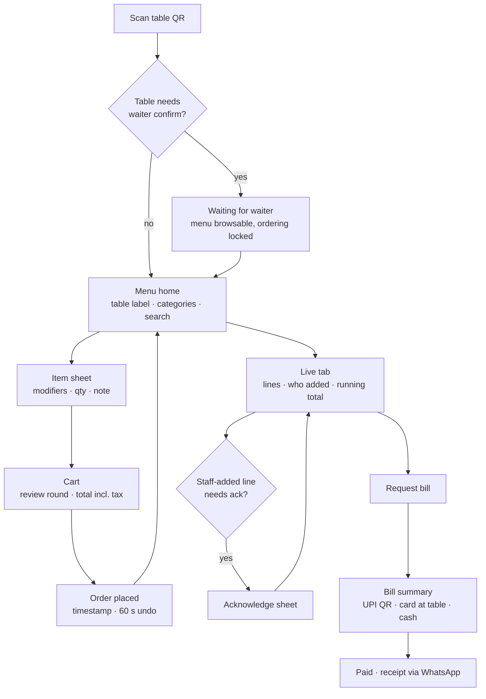
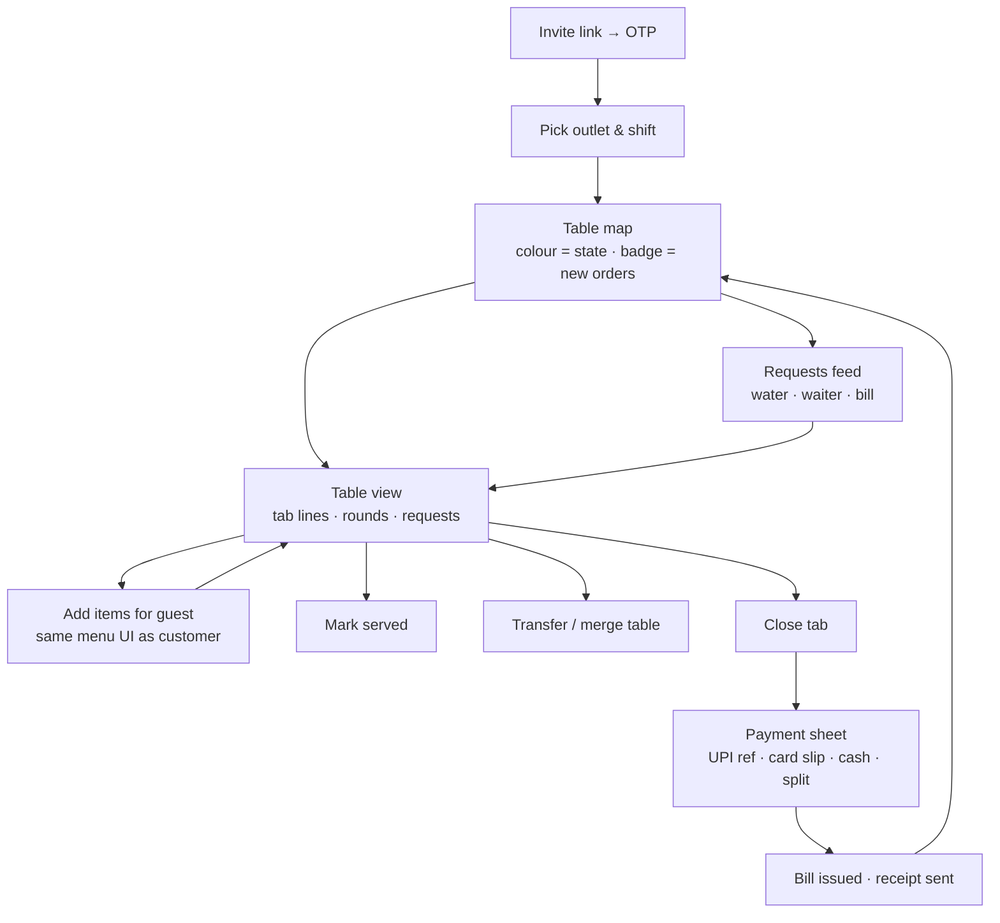
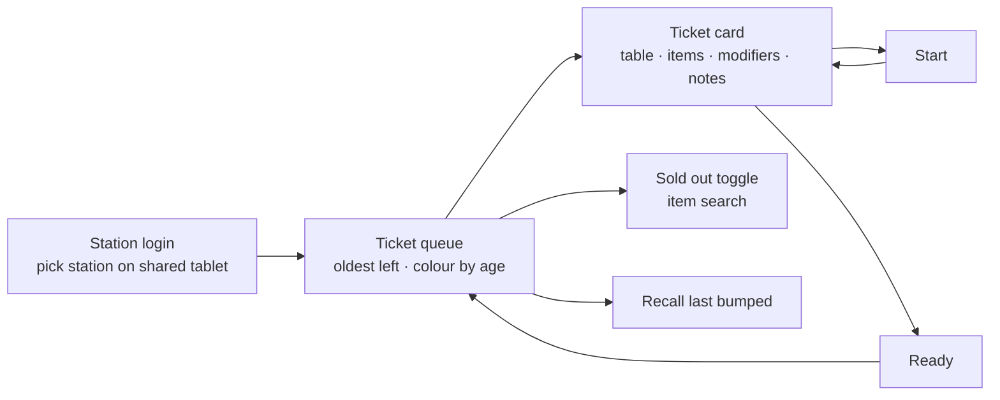
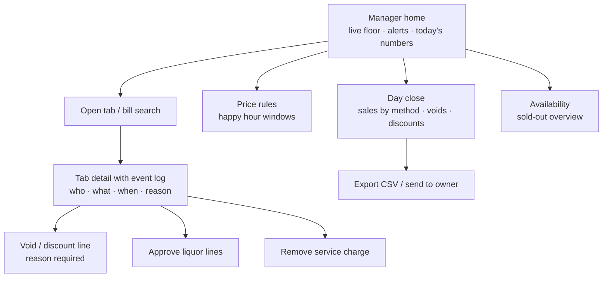
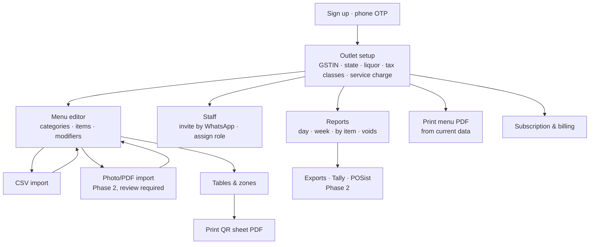

# UI flows

Five role-specific flows and one screen inventory; the customer flow is the one to prototype and time first, because the whole product depends on it taking under 20 seconds.

## 1. Customer flow (PWA, no login)

Target: scan to first order in under 20 seconds, then the tab stays one tap away for the whole visit.

Reading: the loop C → D → E → F is one round; the tab (G) is reachable from a persistent bottom bar on every screen. Undo (F) cancels a line only before the bar or kitchen accepts it.

**Screen notes**

- Menu home: sticky category chips, veg/non-veg filter, "Repeat last round" button after the first order, sold-out items greyed with the label, happy-hour badge with the end time.
- Item sheet: modifier groups enforce min/max; price updates live; note field for "less spicy".
- Cart: shows tax split and service charge as separate lines with a toggle to remove service charge (customer right).
- Order placed: full-screen confirmation with time and round number; this is what a customer refers to in a dispute.
- Live tab: each line shows source ("You", "Ravi (waiter)"), time, price and any applied price rule; voided lines stay visible, struck through, with the reason.
- Persistent bar: Menu · Tab · Call waiter. "Call waiter" opens a sheet with water / waiter / bill so it never becomes a general chat.
- Bill summary: total, payment options in the venue's enabled order; UPI shows the venue's QR with the amount; after the waiter records payment the screen flips to Paid.

## 2. Waiter flow (phone, phone-OTP login)

Target: a new waiter is taking orders within 2 minutes of getting the invite link; every action is two taps from the table map.

Reading: the table map is home; the requests feed is a second tab in the bottom bar with a count badge. Nothing in the waiter app requires typing except a UPI reference, which is optional.

**Screen notes**

- Table map: zones as horizontal sections; table colour = empty / seated / order pending / bill requested; long-press opens a tab without a customer phone.
- Table view: rounds collapsed by time; new lines pulse until acknowledged; staff-added lines above the threshold show "awaiting guest ack".
- Add items: reuses the customer menu component; the waiter's name is recorded on each line automatically.
- Payment sheet: amount pre-filled; split by amount adds rows; the sheet refuses to close until recorded payments equal the bill.
- Offline banner: a thin bar shows "reconnecting, 3 actions queued" rather than blocking.

## 3. Bar / kitchen flow (tablet, shared session)

Target: a ticket appears within 2 seconds of the order and can be bumped with one tap by someone with wet hands.

Reading: the whole MVP screen is the queue; Phase 2 adds per-station routing, prep timers and a printer fallback, but the card layout should not change.

**Screen notes**

- Cards are large (min 44 pt targets), landscape, three columns; age colour turns amber at 8 minutes and red at 15.
- Modifiers and notes are printed in bold under the item; allergens flagged if the menu marks them.
- "Sold out" from the queue pushes availability to customer menus immediately and shows a toast to waiters.
- No numeric keypad anywhere on this screen.

## 4. Manager flow (phone or tablet)

Target: resolve a disputed bill from the event log in under a minute at the table, without calling the owner.

Reading: the event log (C) is the dispute screen; it is read-only and prints or shares as a PDF so a manager can show it to the guest.

**Screen notes**

- Home alerts: bill requested over 5 minutes, ticket over 15 minutes, staff-added line awaiting ack over 3 minutes.
- Void / discount: reason picker (wrong item, guest complaint, spillage, comp) plus free text; the void appears on the guest's tab within seconds.
- Day close: one screen, one button, one PDF; totals by UPI/card/cash must reconcile to recorded payments before close is allowed.

## 5. Owner flow (desktop or tablet)

Target: a venue is live — menu loaded, tables printed, staff invited — in one sitting of about 45 minutes with founder help, and 90 minutes alone.

Reading: setup runs B → C → D → E → F in order with a progress checklist; after go-live the owner mostly opens G.

**Screen notes**

- Outlet setup blocks go-live until a tax class exists (GSTIN is optional for now, see DECISIONS.md); the invoice preview renders live as fields change.
- Menu editor: spreadsheet-like table with inline edit, bulk price change, drag-to-reorder, and a diff view before publishing so a price typo is caught.
- Tables: grid of labels with zone; "regenerate QR" per table invalidates the old print.
- Staff: role chips; a waiter's invite is a WhatsApp deep link; deactivation is one tap for high-turnover venues.
- Reports: day close list, drill to bill, disputed-bill filter; item-level sales for menu decisions.

## 6. Screen inventory

| # | Screen | Surface | Role | MVP |
| --- | --- | --- | --- | --- |
| C1 | QR landing / waiter-confirm wait | Customer PWA | Customer | Yes |
| C2 | Menu home | Customer PWA | Customer | Yes |
| C3 | Item sheet | Customer PWA | Customer | Yes |
| C4 | Cart | Customer PWA | Customer | Yes |
| C5 | Order placed confirmation | Customer PWA | Customer | Yes |
| C6 | Live tab | Customer PWA | Customer | Yes |
| C7 | Acknowledge staff line | Customer PWA | Customer | Yes |
| C8 | Call waiter sheet | Customer PWA | Customer | Yes |
| C9 | Bill summary & pay | Customer PWA | Customer | Yes (record only) |
| C10 | In-app UPI/card checkout | Customer PWA | Customer | Phase 2 |
| C11 | Pickup/delivery address & tracking | Customer PWA | Customer | Phase 3 |
| W1 | OTP login & outlet pick | Staff app | All staff | Yes |
| W2 | Table map | Staff app | Waiter, Manager | Yes |
| W3 | Table / tab view | Staff app | Waiter, Manager | Yes |
| W4 | Add items for guest | Staff app | Waiter, Manager | Yes |
| W5 | Transfer / merge | Staff app | Waiter, Manager | Yes |
| W6 | Payment sheet & close | Staff app | Waiter, Manager | Yes |
| W7 | Requests feed | Staff app | Waiter | Yes |
| K1 | Station pick | Tablet | Bar/Kitchen | Yes |
| K2 | Ticket queue | Tablet | Bar/Kitchen | Basic; full KDS Phase 2 |
| K3 | Sold-out toggle | Tablet | Bar/Kitchen | Yes |
| M1 | Manager home & alerts | Staff app | Manager, Owner | Yes |
| M2 | Tab detail with event log | Staff app | Manager, Owner | Yes |
| M3 | Void / discount | Staff app | Manager, Owner | Yes |
| M4 | Price rules | Staff app | Manager, Owner | Yes |
| M5 | Day close & export | Staff app | Manager, Owner | Yes |
| O1 | Outlet setup | Owner web | Owner | Yes |
| O2 | Menu editor | Owner web | Owner | Yes |
| O3 | CSV import | Owner web | Owner | Yes |
| O4 | Photo/PDF import with review | Owner web | Owner | Phase 2 |
| O5 | Tables & QR print | Owner web | Owner | Yes |
| O6 | Staff & roles | Owner web | Owner | Yes |
| O7 | Reports | Owner web | Owner | Yes |
| O8 | Exports & integrations | Owner web | Owner | Phase 2 |
| O9 | Multi-outlet dashboard | Owner web | Owner | Phase 2 |
| O10 | Subscription | Owner web | Owner | Yes |
| P1 | Onboard / suspend restaurant, audit | Admin web | Platform admin | Yes |

27 MVP screens across four surfaces; the customer PWA is 9 of them and should be prototyped and timed with real guests before the staff surfaces are built.
